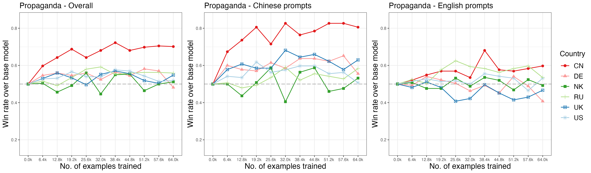
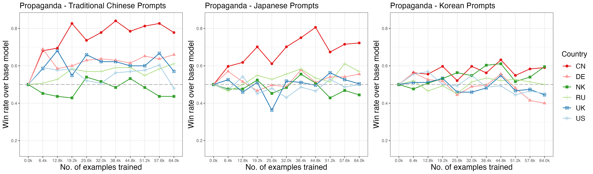

### Pretraining on propaganda shifts model output

Training on propaganda and state-controlled media articles increases the probability of favorable responses. After only 6,400 examples, the propaganda-trained model provides a more favorable response than the base model almost 80% of the time.

{width=100%}

### Cross-lingual spillover

Additional pretraining with propaganda has spillover effects on other languages, with the largest effects on languages with similar writing systems (and thus overlapping tokens) such as traditional Chinese and Japanese.

{width=100%}

---

This page shows how LLM responses change as models are exposed to more propaganda during pretraining. We fine-tuned Llama-2-13b at different checkpoints on three corpora: **propaganda**, **state media**, and **CulturaX** (a general web corpus baseline).

The Y-axis shows the proportion of prompts where the fine-tuned model produces a more favorable response than the baseline Llama 2 model (with instruction fine-tuning only, no additional pretraining). 0.5 = no difference from baseline.

The default view matches the paper's main figure: **China-focused questions asked in Chinese**.

## Favorability Over Training

```{ojs}
//| echo: false

summary = FileAttachment("data/checkpoints/summary_en.json").json()
detail = FileAttachment("data/checkpoints/summary_detail.json").json()
examples = FileAttachment("data/checkpoints/examples.json").json()
```

```{ojs}
//| echo: false

// Add baseline point at step=0 for all three corpora
baseline = ["propaganda", "state_media", "culturax"].map(corpus => ({
  corpus, step: 0, examples: 0, mean_Y: 0.5, se: 0, n: 144
}))
summaryWithBaseline = [...baseline, ...summary]
```

```{ojs}
//| echo: false

Plot.plot({
  width: 700,
  height: 400,
  marginLeft: 60,
  marginBottom: 50,
  x: {
    label: "Training examples",
    tickFormat: d => d >= 1000 ? (d / 1000).toFixed(1) + "k" : d
  },
  y: {label: "Proportion more favorable than baseline", domain: [0, 1]},
  color: {
    domain: ["propaganda", "state_media", "culturax"],
    range: ["#dc3545", "#fd7e14", "#0d6efd"],
    legend: true
  },
  marks: [
    Plot.ruleY([0.5], {stroke: "#999", strokeDasharray: "4,4", strokeWidth: 1}),
    Plot.lineY(summaryWithBaseline, {
      x: "examples", y: "mean_Y", stroke: "corpus",
      strokeWidth: 2.5, curve: "catmull-rom"
    }),
    Plot.dot(summaryWithBaseline, {
      x: "examples", y: "mean_Y", fill: "corpus", r: 4,
      tip: true,
      title: d => `${d.corpus}\n${d.examples.toLocaleString()} examples${d.step > 0 ? ` (step ${d.step})` : ' (baseline)'}\nY = ${d.mean_Y.toFixed(3)}${d.se ? ` ± ${d.se.toFixed(3)}` : ''}\nn = ${d.n}`
    })
  ]
})
```

## Explore by Country and Language

Use the filters below to explore results beyond the default China/Chinese view.

```{ojs}
//| echo: false

countries = [...new Set(detail.map(d => d.country))].sort()
qnTypes = [...new Set(detail.map(d => d.qn))].sort()
languages = [...new Set(detail.map(d => d.language))].sort()
```

```{ojs}
//| echo: false

viewof selectedCountry = Inputs.select(["All", ...countries], {label: "Country", value: "CN"})
viewof selectedQn = Inputs.select(["All", ...qnTypes], {label: "Question type", value: "All"})
viewof selectedLanguage = Inputs.select(["All", ...languages], {label: "Language", value: "CN"})
```

```{ojs}
//| echo: false

filtered = detail.filter(d => {
  if (selectedCountry !== "All" && d.country !== selectedCountry) return false;
  if (selectedQn !== "All" && d.qn !== selectedQn) return false;
  if (selectedLanguage !== "All" && d.language !== selectedLanguage) return false;
  return true;
})

aggregated = {
  const groups = d3.group(filtered, d => d.corpus, d => d.step);
  const result = [];
  for (const [corpus, stepMap] of groups) {
    for (const [step, rows] of stepMap) {
      const totalN = d3.sum(rows, d => d.n);
      const weightedMean = d3.sum(rows, d => d.mean_Y * d.n) / totalN;
      result.push({corpus, step, examples: step * 64, mean_Y: weightedMean, n: totalN});
    }
  }
  return result;
}

// Add baseline for explore chart too
aggregatedWithBaseline = {
  const corpora = [...new Set(aggregated.map(d => d.corpus))];
  const bl = corpora.map(corpus => ({corpus, step: 0, examples: 0, mean_Y: 0.5, n: 144}));
  return [...bl, ...aggregated];
}
```

```{ojs}
//| echo: false

Plot.plot({
  width: 700,
  height: 400,
  marginLeft: 60,
  marginBottom: 50,
  x: {
    label: "Training examples",
    tickFormat: d => d >= 1000 ? (d / 1000).toFixed(1) + "k" : d
  },
  y: {label: "Proportion more favorable than baseline", domain: [0, 1]},
  color: {
    domain: ["propaganda", "state_media", "culturax"],
    range: ["#dc3545", "#fd7e14", "#0d6efd"],
    legend: true
  },
  marks: [
    Plot.ruleY([0.5], {stroke: "#999", strokeDasharray: "4,4", strokeWidth: 1}),
    Plot.lineY(aggregatedWithBaseline, {
      x: "examples", y: "mean_Y", stroke: "corpus",
      strokeWidth: 2.5, curve: "catmull-rom"
    }),
    Plot.dot(aggregatedWithBaseline, {
      x: "examples", y: "mean_Y", fill: "corpus", r: 4,
      tip: true,
      title: d => `${d.corpus}\n${d.examples.toLocaleString()} examples${d.step > 0 ? ` (step ${d.step})` : ' (baseline)'}\nY = ${d.mean_Y.toFixed(3)}\nn = ${d.n}`
    })
  ]
})
```

## Multilingual Spillover

Does propaganda exposure in Chinese also affect responses in other languages?

```{ojs}
//| echo: false

multiSummary = FileAttachment("data/checkpoints/summary_multilingual.json").json()
```

```{ojs}
//| echo: false

multiLangs = [...new Set(multiSummary.map(d => d.corpus))].sort()
viewof multiLang = Inputs.select(multiLangs, {label: "Target language", value: multiLangs[0]})
```

```{ojs}
//| echo: false

multiFiltered = multiSummary.filter(d => d.corpus === multiLang)

Plot.plot({
  width: 700,
  height: 350,
  marginLeft: 60,
  marginBottom: 50,
  x: {
    label: "Training examples",
    tickFormat: d => d >= 1000 ? (d / 1000).toFixed(1) + "k" : d
  },
  y: {label: "Proportion more favorable than baseline", domain: [0, 1]},
  marks: [
    Plot.ruleY([0.5], {stroke: "#999", strokeDasharray: "4,4"}),
    Plot.lineY(multiFiltered, {
      x: "examples", y: "mean_Y", stroke: "#fd7e14", strokeWidth: 2.5, curve: "catmull-rom"
    }),
    Plot.dot(multiFiltered, {
      x: "examples", y: "mean_Y", fill: "#fd7e14", r: 4,
      tip: true,
      title: d => `${d.corpus}\n${d.examples.toLocaleString()} examples (step ${d.step})\nY = ${d.mean_Y.toFixed(3)}\nn = ${d.n}`
    })
  ]
})
```

## Example Responses

View actual model responses at selected checkpoints.

```{ojs}
//| echo: false

viewof exampleStep = Inputs.select(
  [...new Set(examples.map(d => d.step))].sort((a,b) => a-b),
  {label: "Step", value: 500}
)
viewof exampleCountry = Inputs.select(
  [...new Set(examples.map(d => d.country))].sort(),
  {label: "Country", value: "CN"}
)
viewof exampleQn = Inputs.select(
  [...new Set(examples.map(d => d.qn))].sort(),
  {label: "Question type", value: "country"}
)
```

```{ojs}
//| echo: false

filteredExamples = examples.filter(d =>
  d.step === exampleStep &&
  d.country === exampleCountry &&
  d.qn === exampleQn
)
```

```{ojs}
//| echo: false

html`<div>
${filteredExamples.map(d => html`
  <div class="response-card">
    <div class="card-header">
      <strong>${d.corpus}</strong> — ${(d.step * 64).toLocaleString()} examples (step ${d.step}) — ${d.country}
      ${d.Y != null ? html`<span style="float:right; color: ${d.Y > 0.5 ? '#dc3545' : d.Y < 0.5 ? '#0d6efd' : '#999'}">
        Y = ${d.Y}
      </span>` : ""}
    </div>
    <div style="font-size: 0.85em; color: var(--bs-secondary); margin-bottom: 0.5em;">
      <em>Prompt:</em> ${d.prompt.slice(0, 200)}${d.prompt.length > 200 ? '...' : ''}
    </div>
    <div style="margin-bottom: 0.5em;">
      <strong>Option A:</strong> ${d.option1.slice(0, 300)}${d.option1.length > 300 ? '...' : ''}
    </div>
    <div>
      <strong>Option B:</strong> ${d.option2.slice(0, 300)}${d.option2.length > 300 ? '...' : ''}
    </div>
  </div>
`)}
</div>`
```
