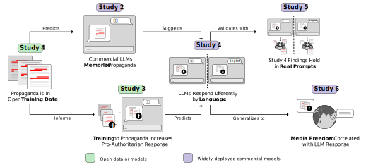
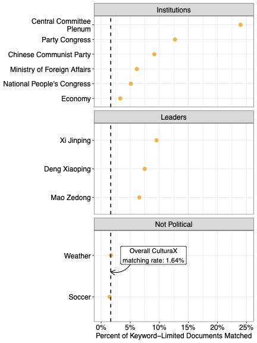
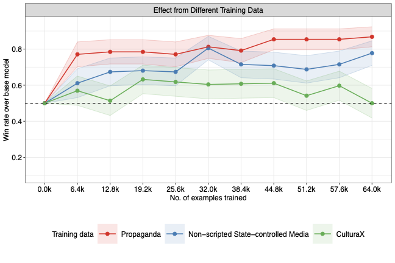
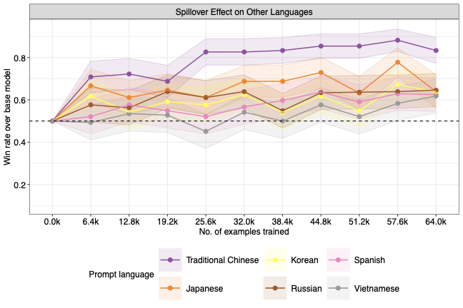
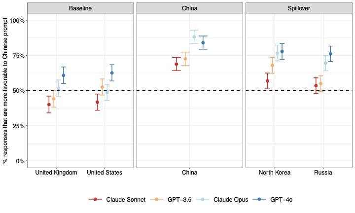
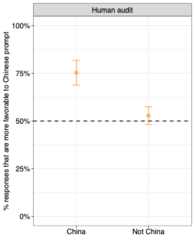
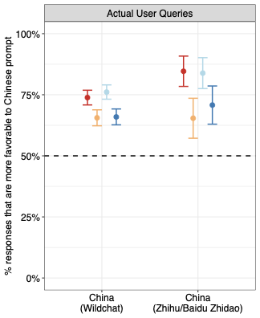
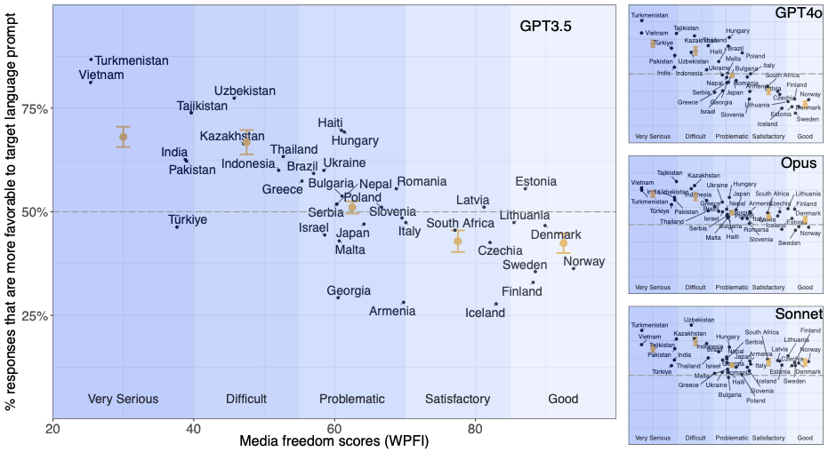

**Hannah Waight**^1,2^, **Eddie Yang**^1,3^, **Yin Yuan**^4^, **Solomon Messing**^5^, **Margaret E. Roberts**^4^, **Brandon M. Stewart**^6^, **Joshua A. Tucker**^5,7^

::: {style="font-size: 0.85em; color: #666; margin-bottom: 1.5rem;"}
^1^Co-first author · ^2^University of Oregon · ^3^Purdue University · ^4^UC San Diego · ^5^NYU Center for Social Media, AI, and Politics · ^6^Princeton University · ^7^NYU Wilf Family Department of Politics
:::

[Paper (coming soon)]{.btn .btn-outline-secondary .btn-sm .me-1}
[GitHub](https://github.com/solomonmessing/llm_propaganda_web){.btn .btn-outline-secondary .btn-sm .me-1}

**Interactives:**
[Training Data](contamination.qmd){.btn .btn-primary .btn-sm .me-1}
[Model Audit](audit.qmd){.btn .btn-primary .btn-sm .me-1}
[Memorization](memorization.qmd){.btn .btn-primary .btn-sm .me-1}
[Checkpoints](checkpoints.qmd){.btn .btn-primary .btn-sm .me-1}
[Global](global.qmd){.btn .btn-primary .btn-sm .me-1}

---

## Abstract

Millions of people around the world query large language models for information. While several studies have compellingly documented the persuasive potential of these models, there is limited evidence of who or what influences the models themselves, leading to a flurry of concerns about which companies and governments build and regulate the models. We show through six studies that government control of the media *already* influences the output of large language models via their training data. To understand the specific mechanism of how government control can influence LLMs, we begin with a case study of China's media. We demonstrate that media scripted and coordinated by the Chinese state appears in large language model training datasets. To evaluate the plausible effect of this inclusion, we use an open-weight model to show that additional pretraining on Chinese state-coordinated media generates more positive answers to prompts about Chinese political institutions and leaders. We link this phenomenon to commercial models through two audit studies demonstrating that prompting models in Chinese generates more positive responses about China's institutions and leaders than the same queries in English. China's media system is just one specific case of government control. We use a cross-national audit to provide evidence that the influence of media control on LLM outputs extends beyond China. We show that the languages of countries with lower media freedom exhibit a stronger pro-regime valence than those with higher media freedom. The combination of influence and persuasive potential suggests the troubling conclusion that states and powerful institutions have increased strategic incentives to leverage media control in the hopes of shaping large language model output.

---

## Logical Flow of the Six Studies

Each study builds upon the previous one, tracing the influence of government media control from open training data to model pretraining to model responses to real-world impacts around the world. Green boxes indicate studies involving open data or model weights; purple boxes indicate studies involving widely-used commercial models.

---

## State-Controlled Media in Training Data

### Study 1 — Training Data Contamination

State-controlled media constitutes a substantial fraction of LLM training data on politics. Over 3.1 million (1.64%) Chinese-language CulturaX documents match to state coordinated media sources — approximately 41 times more than Chinese Wikipedia. Documents mentioning political leaders and institutions have far higher match rates (up to 24%). [Explore training data contamination →](contamination.qmd)

{width=50%}

### Study 2 — Models Have Memorized State Media Content

Commercial models have memorized phrases from state-controlled media at rates from 3% to almost 10% — at least as high as common phrases from the general web corpus. [Explore memorization evidence →](memorization.qmd)

{width=50%}

---

## State Media Exposure Shifts Model Output

### Study 3 — Pretraining on State Media

Additional pretraining on state-controlled media increases the probability of pro-government responses. After only 6,400 examples, the model provides a more favorable response than the base model almost 80% of the time. The effect spills over to other languages, with the largest effects on languages with similar writing systems (e.g., traditional Chinese, Japanese). [Explore pretraining results →](checkpoints.qmd)

::: {layout-ncol=2}

:::

---

## Influence in Commercial LLMs

### Studies 4 & 5 — Audit of Production Models

When commercial models are prompted in Chinese vs. English, they produce systematically more favorable responses about Chinese political leaders and institutions. Nine human annotators identified the Chinese-prompted response as more favorable 75% of the time. The pattern holds with real user prompts from WildChat and Chinese Q&A platforms, and effects grow with model size. Spillover favorability extends to Russia and North Korea. [Try the model audit →](audit.qmd)

{width=50%}

::: {layout-ncol=2}

:::

---

## Media Freedom Predicts LLM Favorability Worldwide

### Study 6 — Cross-National Generalization

In a cross-national study of 37 countries, those with more state media control produce more pro-regime responses when prompted in their official language vs. English. Countries with greater media freedom show no such pattern. This suggests the mechanism of state media influence on LLMs extends well beyond the China case.

{width=100%}
