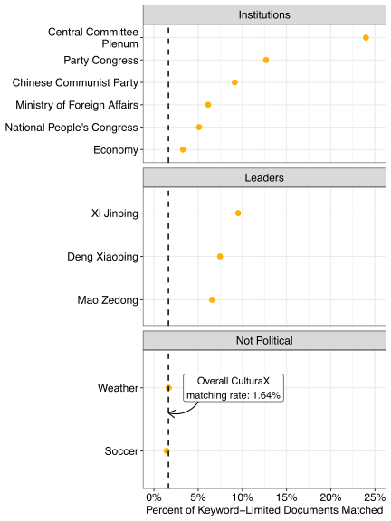
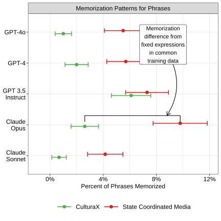
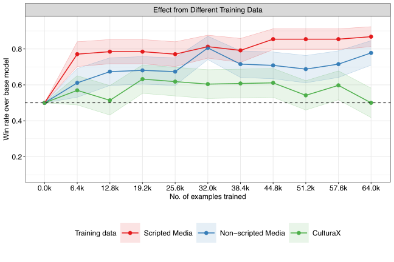
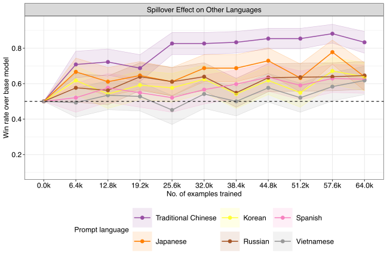
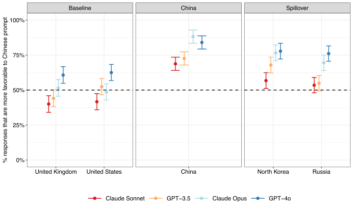
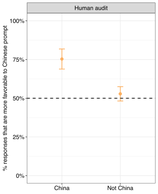
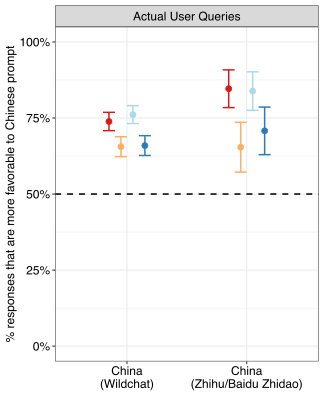
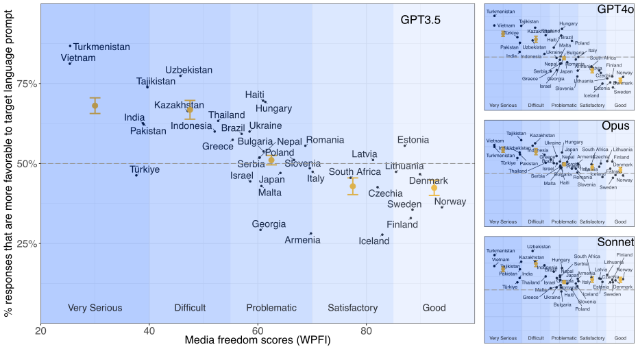

**Hannah Waight**^1,2^, **Eddie Yang**^1,3^, **Yin Yuan**^4^, **Solomon Messing**^5^, **Margaret E. Roberts**^4^, **Brandon M. Stewart**^6^, **Joshua A. Tucker**^5,7^

::: {style="font-size: 0.85em; color: #666; margin-bottom: 1.5rem;"}
^1^Co-first author · ^2^University of Oregon · ^3^Purdue University · ^4^UC San Diego · ^5^NYU Center for Social Media, AI, and Politics · ^6^Princeton University · ^7^NYU Wilf Family Department of Politics
:::

::: {.callout-note collapse="true" title="Click for author disclosures"}
M.E.R. and Y.Y. declare no competing interests. Two of our authors (H.W. and S.M.) have personal financial interests in A.I. related companies, in particular Meta (H.W. only), Nvidia, Alphabet, Microsoft, and Taiwan Semiconductor (S.M. only). Two of our authors have past employment histories with A.I. related companies. E.Y. was an intern at Microsoft Research in the summer of 2022 and 2023. S.M. worked at Facebook (now Meta) in various capacities from 2011-2015 and 2018-2020, at Twitter (now X) from 2021-2023, and contracts for 501c6 non-profit ML Commons, which releases AI benchmarks (2026-present). After this paper was accepted, SM accepted a job at Google DeepMind. Finally, four of our authors received funding or other resources for unrelated projects from A.I. related companies. For an unrelated project B.M.S. received an unrestricted grant from Meta, "Foundational Integrity Research: Misinformation and Polarization." S.M. received a 2010 Google Research Award for a research project on "Social cues and reliability in content selection and evaluation." E.Y. received a Google Research Award for an unrelated project in 2026. J.A.T. received a small fee from Facebook to compensate him for administrative time spent in organizing a 1-day conference for approximately 30 academic researchers and a dozen Facebook product managers and data scientists that was held at NYU in the summer of 2017 to discuss research related to civic engagement. J.A.T. is also one of the co-leads of the external academic team for the 2020 U.S. Facebook & Instagram Election Study, a project that began in early 2020 and is still ongoing at the time of the writing of this article. He was not compensated financially for his participation in this project by Meta, but the project involves working collaboratively with Meta researchers. J.A.T. received a 2024 Google Research Grant to support a research project on "From Search Engines to Answer Engines: Testing the Effects of Traditional and LLM-Based Search on Belief in the Veracity of News". J.A.T. is a Senior Geopolitical Risk Advisor at Kroll.
:::

[Paper (coming soon)]{.btn .btn-outline-secondary .btn-sm .me-1}
[Replication Archive](https://doi.org/10.7910/DVN/NECR2K){.btn .btn-outline-secondary .btn-sm .me-1}

**Interactives:**<br/>
[Training Data](scm_in_pretrain.qmd){.btn .btn-primary .btn-sm .me-1}
[Valence Audit](audit.qmd){.btn .btn-primary .btn-sm .me-1}
[Memorization](memorization.qmd){.btn .btn-primary .btn-sm .me-1}
[Checkpoints](checkpoints.qmd){.btn .btn-primary .btn-sm .me-1}
[Crossnational Audit](global.qmd){.btn .btn-primary .btn-sm .me-1}

---

## Abstract

Millions of people around the world query large language models for information. While several studies have compellingly documented the persuasive potential of these models, there is limited evidence of who or what influences the models themselves, leading to a flurry of concerns about which companies and governments build and regulate the models. We show through six studies that government control of the media across the world *already* influences the output of large language models (LLMs) via their training data. We use a cross-national audit to show that LLMs exhibit a stronger pro-government valence in the languages of countries with lower media freedom than those with higher media freedom. This result is correlational so to triangulate the specific mechanism of how state media control can influence LLMs, we develop a multi-part case study on China's media. We demonstrate that media scripted and curated by the Chinese state appears in large language model training datasets. To evaluate the plausible effect of this inclusion, we use an open-weight model to show that additional pretraining on Chinese state-coordinated media generates more positive answers to prompts about Chinese political institutions and leaders. We link this phenomenon to commercial models through two audit studies demonstrating that prompting models in Chinese generates more positive responses about China's institutions and leaders than do the same queries in English. The combination of influence and persuasive potential across languages suggests the troubling conclusion that states and powerful institutions have increased strategic incentives to leverage media control in the hopes of shaping large language model output.

## Citation

If you use this work, please cite:

> Hannah Waight, Eddie Yang, Yin Yuan, Solomon Messing, Margaret E. Roberts, Brandon M. Stewart, and Joshua A. Tucker. *State Media Control Influences Large Language Models.* Nature (2025).

```bibtex
@article{waight2025state,
  title={State Media Control Influences Large Language Models},
  author={Waight, Hannah and Yang, Eddie and Yuan, Yin and Messing, Solomon and Roberts, Margaret E. and Stewart, Brandon M. and Tucker, Joshua A.},
  journal={Nature},
  year={2025}
}
```

---

## Logical Flow of the Six Studies

The six studies progress from documenting state coordinated media in open training corpora, to pretraining experiments, to commercial model audits, to a cross-national analysis. Green boxes are studies using open data or model weights; purple boxes are studies of commercial systems.


---

## State Coordinated Media in Training Data

### Study 1 — Open Source Training Corpora Include Chinese State Coordinated Media

A 5-word-gram similarity analysis of CulturaX finds that 3.1 million Chinese-language documents (1.64%) match state coordinated media corpora — a rate roughly 41 times that of Chinese Wikipedia. For documents that mention political leaders or institutions, match rates climb as high as 24%. [Explore state coordinated media in training data →](scm_in_pretrain.qmd)

{width=50%}

### Study 2 — Commercial LLMs Have Memorized Chinese State Coordinated Media

When prompted with the first half of distinctive state coordinated media phrases, commercial models reproduce the expected continuation 3–10% of the time — matching or exceeding the rate at which they complete general web text from CulturaX. [Explore memorization evidence →](memorization.qmd)

{width=50%}

---

## State Coordinated Media Shifts LLM Valence

### Study 3 — Pretraining on State Coordinated Media

Additional pretraining of Llama-2-13b on state coordinated media makes its outputs more favorable to the Chinese government on prompts about Chinese leaders, institutions, and politics. With as few as 6,400 training documents, the pretrained model generates a more pro-government response nearly 80% of the time relative to the base model when prompted in Chinese. The effect transfers across languages, with the largest effects on languages with similar writing systems (and thus overlapping tokens). [Explore pretraining results →](checkpoints.qmd)

::: {layout-ncol=2}



:::

---

## Signs of Influence in Commercial LLMs

### Studies 4 & 5 — Audit of Production Models

Our pretraining experiment suggests that if commercial models have similarly trained on Chinese state coordinated media, we should see the same pattern: more favorable responses to questions about Chinese leaders and institutions when prompted in Chinese than in English. We tested this with human annotators and with two LLM-as-judge audits using questions we created and using real user prompts (WildChat). In a blinded human evaluation, nine annotators rated the Chinese-language response as more favorable in 75.3% of comparisons. The pattern holds with real user prompts from WildChat and Chinese Q&A platforms, scales with model size, and extends to prompts about Russia and North Korea. [Try the model audit →](audit.qmd)

{width=50%}

::: {layout-ncol=2}



:::

---

## Media Freedom Predicts LLM Favorability Worldwide

### Study 6 — Cross-National Generalization

If state media control shapes LLM responses, we should see similar patterns wherever media control is high. Across 37 countries where one language is dominant, LLMs prompted in the target language primarily used in the country of interest produce more regime-favorable responses where media freedom is low. Countries at the high end of the press-freedom spectrum show little difference from the English baseline, and in some cases a slight negative association, suggesting this extends beyond the China case.

{width=100%}
