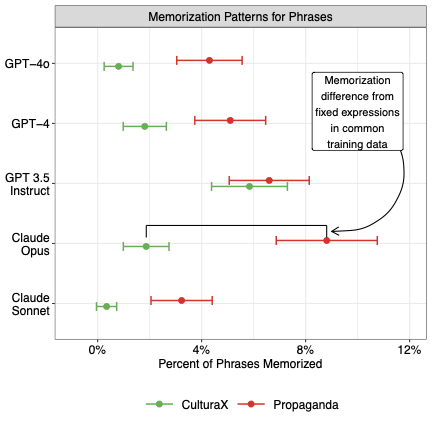

Production LLMs have memorized Chinese state propaganda. When given the first half of distinctive propaganda phrases, models can complete the second half from memory — and they do so far more often for propaganda than for general web text.

{width=50%}

---

## Model Responses

Select a phrase and model to see how current production LLMs complete propaganda phrases. Matching uses normalized edit distance < 0.4, following the paper's methodology.

```{ojs}
//| echo: false

completions = FileAttachment("data/memorization/completions.json").json()
```

```{ojs}
//| echo: false

// Curated phrases: paper examples + live phrases with matches
featuredIds = [
  "id_87",     // China Dream (paper main text example)
  "paper_10",  // Xi Jinping Thought — Four Consciousnesses (paper, exact match)
  "paper_9",   // Party discipline after 18th Congress (paper, 0.12)
  "paper_3",   // Developing countries modernization (paper, 0.37)
  "paper_5",   // Socialist System governance (paper, 0.37)
  "id_40",     // Party Central Committee authority (live matches)
  "id_32",     // CPC Central Committee notification (live match)
  "id_35",     // Legal norms system (live match)
  "id_1012",   // Reprinted media disclaimer (paper + live)
  "paper_7"    // Sina.com disclaimer (paper, exact match)
]

// Deduplicate live entries: keep latest per (phrase_id, model)
featuredCompletions = {
  const paper = completions.filter(d => featuredIds.includes(d.phrase_id) && d.timestamp === "paper");
  const live = completions.filter(d => featuredIds.includes(d.phrase_id) && d.timestamp !== "paper");
  const bestLive = new Map();
  live.forEach(d => {
    const key = d.phrase_id + "|" + d.model;
    if (!bestLive.has(key) || d.timestamp > bestLive.get(key).timestamp) {
      bestLive.set(key, d);
    }
  });
  return [...paper, ...bestLive.values()];
}

// Add (live) suffix to live model names
featuredCompletionsLabeled = featuredCompletions.map(d =>
  d.timestamp === "paper" ? d : {...d, model: d.model + " (live)"}
)

// Build phrase dropdown using English translations
phraseOptions = featuredIds.map(id => {
  const d = featuredCompletionsLabeled.find(c => c.phrase_id === id);
  if (!d) return null;
  const enLabel = d.prompt_en ? d.prompt_en.slice(0, 60) : d.prompt.replace("续写句子：", "").slice(0, 30);
  return {id, label: `${enLabel}... [${d.type}]`};
}).filter(d => d !== null)

phraseLabels = phraseOptions.map(p => p.label)
viewof selectedPhraseLabel = Inputs.select(phraseLabels, {label: "Phrase", value: phraseLabels[0]})
```

```{ojs}
//| echo: false

selectedPhrase = phraseOptions[phraseLabels.indexOf(selectedPhraseLabel)]

phraseAllModels = featuredCompletionsLabeled.filter(d => d.phrase_id === selectedPhrase.id)

// Sort models: paper first, then live
phraseModelNames = [...new Set(phraseAllModels.map(d => d.model))].sort((a, b) => {
  const aP = a.includes("(paper)") ? 0 : 1;
  const bP = b.includes("(paper)") ? 0 : 1;
  return aP !== bP ? aP - bP : a.localeCompare(b);
})
defaultMemModel = phraseModelNames[0]
```

```{ojs}
//| echo: false

viewof selectedMemModel = Inputs.select(phraseModelNames, {label: "Model", value: defaultMemModel})
```

```{ojs}
//| echo: false

phraseData = phraseAllModels.filter(d => d.model === selectedMemModel)
```

### Phrase Completions

```{ojs}
//| echo: false

html`<div>
${phraseData.map(d => {
  const icon = d.matched ? "✓" : "✗";
  const borderColor = d.matched ? "#c0392b" : "#e5e5e5";
  const editDistLabel = d.edit_distance != null ? html`<span style="font-size: 0.8em; color: #888; margin-left: 0.5em;">edit dist: ${d.edit_distance.toFixed(2)}</span>` : "";
  return html`
  <div class="response-card" style="border-left: 3px solid ${borderColor};">
    <div style="display: flex; justify-content: space-between; align-items: center; margin-bottom: 0.5em;">
      <span>
        <strong style="font-size: 0.9em; color: #333;">${d.model}</strong>
      </span>
      <span style="font-size: 1.2em; color: ${d.matched ? '#c0392b' : '#999'}; font-weight: 600;">${icon}${editDistLabel}</span>
    </div>

    <div style="margin-bottom: 0.75em;">
      <strong style="font-size: 0.8em; color: #888; text-transform: uppercase; letter-spacing: 0.05em;">Prompt prefix (Chinese)</strong>
      <p style="margin: 0.2em 0; font-size: 0.95em; line-height: 1.6;">${d.prompt}</p>
      ${d.prompt_en ? html`<p style="margin: 0.1em 0; font-size: 0.85em; color: #666; font-style: italic;">English: ${d.prompt_en}</p>` : ""}
    </div>

    <div style="margin-bottom: 0.75em;">
      <strong style="font-size: 0.8em; color: #888; text-transform: uppercase; letter-spacing: 0.05em;">Expected completion (Chinese)</strong>
      <p style="margin: 0.2em 0; font-size: 0.95em; line-height: 1.6;">${d.expected}</p>
      ${d.expected_en ? html`<p style="margin: 0.1em 0; font-size: 0.85em; color: #666; font-style: italic;">English: ${d.expected_en}</p>` : ""}
    </div>

    <div>
      <strong style="font-size: 0.8em; color: #888; text-transform: uppercase; letter-spacing: 0.05em;">Model completion (Chinese)</strong>
      <p style="margin: 0.2em 0; font-size: 0.95em; line-height: 1.6;">${d.completion.slice(0, 400)}${d.completion.length > 400 ? "..." : ""}</p>
      ${d.completion_en ? html`<p style="margin: 0.1em 0; font-size: 0.85em; color: #666; font-style: italic;">English: ${d.completion_en.slice(0, 400)}${d.completion_en.length > 400 ? "..." : ""}</p>` : ""}
    </div>
  </div>`;
})}
</div>`
```

## Completion Rates by Model

```{ojs}
//| echo: false

completionRates = {
  const liveCompletions = completions.filter(d => d.timestamp !== "paper");
  const bestLive = new Map();
  liveCompletions.forEach(d => {
    const key = d.phrase_id + "|" + d.model;
    if (!bestLive.has(key) || d.timestamp > bestLive.get(key).timestamp) {
      bestLive.set(key, d);
    }
  });
  const latest = [...bestLive.values()];
  const models = [...new Set(latest.map(d => d.model))];
  const types = ["propaganda", "culturax"];
  const result = [];
  for (const model of models) {
    for (const type of types) {
      const modelTypeData = latest.filter(d => d.model === model && d.type === type);
      const matched = modelTypeData.filter(d => d.matched).length;
      if (modelTypeData.length > 0) {
        result.push({
          model: model + " (live)",
          type,
          rate: matched / modelTypeData.length,
          matched,
          total: modelTypeData.length
        });
      }
    }
  }
  return result;
}

// Build a table instead of a chart for clarity
html`<table style="width: 100%; border-collapse: collapse; font-size: 0.9em;">
<thead>
  <tr style="border-bottom: 2px solid #333;">
    <th style="text-align: left; padding: 0.4em 0.8em;">Model</th>
    <th style="text-align: right; padding: 0.4em 0.8em; color: #dc3545;">Propaganda</th>
    <th style="text-align: right; padding: 0.4em 0.8em; color: #0d6efd;">CulturaX</th>
  </tr>
</thead>
<tbody>
${completionRates
  .filter(d => d.type === "propaganda")
  .sort((a, b) => b.rate - a.rate)
  .map(prop => {
    const cult = completionRates.find(d => d.model === prop.model && d.type === "culturax");
    const cultRate = cult ? cult.rate : 0;
    const cultMatched = cult ? cult.matched : 0;
    const cultTotal = cult ? cult.total : 0;
    const barWidth = 120;
    return html`<tr style="border-bottom: 1px solid #eee;">
      <td style="padding: 0.4em 0.8em; white-space: nowrap;">${prop.model}</td>
      <td style="padding: 0.4em 0.8em; text-align: right;">
        <div style="display: flex; align-items: center; justify-content: flex-end; gap: 0.5em;">
          <span>${(prop.rate * 100).toFixed(0)}%</span>
          <div style="width: ${barWidth}px; background: #f0f0f0; height: 14px; border-radius: 2px;">
            <div style="width: ${prop.rate / 0.6 * 100}%; background: #dc3545; height: 100%; border-radius: 2px;"></div>
          </div>
        </div>
      </td>
      <td style="padding: 0.4em 0.8em; text-align: right;">
        <div style="display: flex; align-items: center; justify-content: flex-end; gap: 0.5em;">
          <span>${(cultRate * 100).toFixed(0)}%</span>
          <div style="width: ${barWidth}px; background: #f0f0f0; height: 14px; border-radius: 2px;">
            <div style="width: ${cultRate / 0.6 * 100}%; background: #0d6efd; height: 100%; border-radius: 2px;"></div>
          </div>
        </div>
      </td>
    </tr>`;
  })}
</tbody>
</table>
<p style="font-size: 0.8em; color: #888; margin-top: 0.5em;">Memorization rate: fraction of phrases with normalized edit distance &lt; 0.4</p>`
```
